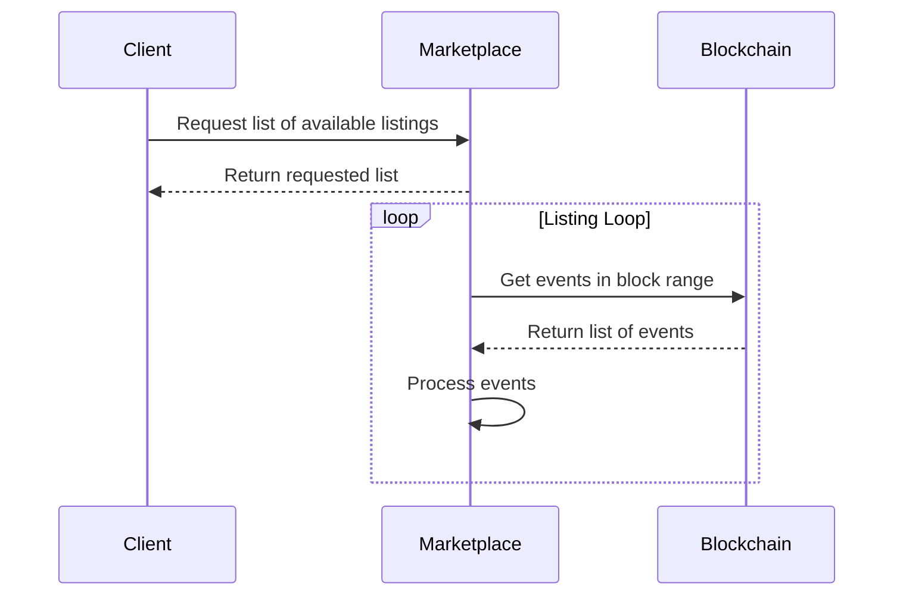

# Goated Goats Marketplace
## Data Flow
Below you can find basic Marketplace data flow:

To simplify the process we will not use real-time updates via websockets. In order to see changes in a list user will need to refresh the page.

## Front End
🚧 Under construction 🚧

## Back End
🚧 Under construction 🚧

